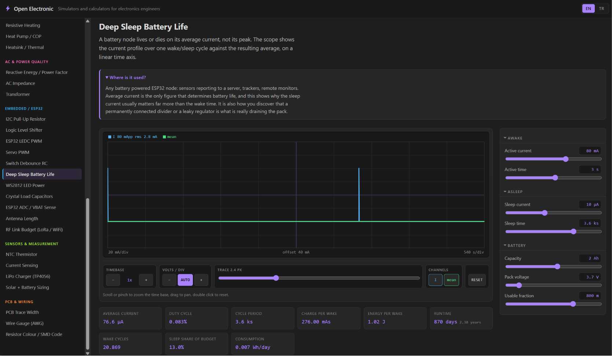

# open-electronic

### [Open the simulators](https://hamzayslmn.github.io/open-electronic/)



Browser-based electronics simulators and calculators for engineers. No install, no sign-up,
nothing sent to a server: every formula runs in your browser.

Aimed at ESP32 and hobby-electronics work, so 3.3 V is the default supply everywhere unless
the part genuinely needs something else.

## What it does

Pick a simulator from the list on the left, change a value, and the answer updates instantly.
Most pages drive a live oscilloscope so you can see the waveform, not just a number.

- **Real formulas.** Every page implements the actual maths, cited in a "the maths behind this
  page" panel at the bottom. Nothing is approximated for convenience.
- **Live oscilloscope.** Shared across every page. Scroll or pinch to zoom the time base, drag
  to pan, adjust trace thickness and volts per division, toggle channels.
- **Engineering notation.** Type `4k7`, `100n` or `2.2 uF` into any field and it parses.
- **Honest warnings.** When you leave the region where a model holds, a transistor out of
  saturation, a converter in discontinuous conduction, a GPIO over its current limit, the page
  says so instead of quietly printing an unphysical number.

See [SIMULATORS.md](SIMULATORS.md) for the full catalogue and the formula behind each one.

## Running it locally

Requires [Node](https://nodejs.org) and [pnpm](https://pnpm.io).

```bash
git clone https://github.com/HamzaYslmn/open-electronic.git
cd open-electronic/web
pnpm install
pnpm dev
```

Then open <http://localhost:5173>.

```bash
pnpm test     # run the engine tests
pnpm build    # type-check and produce a production build
```

## How it is put together

```
web/src/
  engine/   pure TypeScript maths, no React, one module per topic plus its tests
  ui/       shared components: the oscilloscope, sliders, readout tiles, page layout
  sims/     one file per simulator
  catalog.ts  the registry that drives the routes, the sidebar and the home page
```

The maths is kept completely separate from the interface. That is what makes it testable:
the engine is plain functions over numbers, so every formula has unit tests asserting it
against textbook values rather than against itself.

## Deployment

Pushing to `main` runs [the Pages workflow](.github/workflows/pages.yml), which installs,
runs the tests, builds, and publishes to GitHub Pages. A failing test blocks the deploy, so
the live site never has a broken formula on it.

To enable it on a fork: **Settings, Pages, Source, GitHub Actions**. If your repository has a
different name, change `REPO_BASE` in [web/vite.config.ts](web/vite.config.ts) to match, since
Pages serves the site from a subpath.

## Contributing

Adding a simulator is three steps:

1. Write `web/src/engine/<topic>.ts` with the formulas, plus `<topic>.test.ts`.
2. Write `web/src/sims/<id>.tsx` using the shared components.
3. Set that entry's `status` to `'ready'` in `web/src/catalog.ts` and attach its import.

The routes, sidebar and home page pick it up automatically.

## Licence

[MIT](LICENSE).
